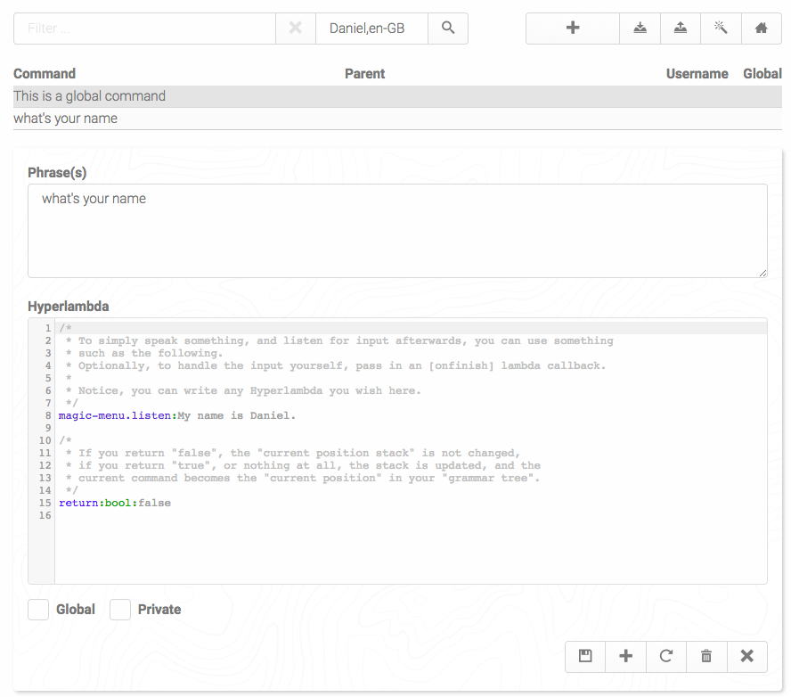

# Magic Menu

Magic Menu is an Ajax navbar and menu system, working across all your Phosphorus Five 
apps, allowing you to easily navigate your apps, and associate small pieces of Hyperlambda, with
some _"navbar"_ item. It is extremly configurable, and among other things features speech
recoginition and speech synthesis to navigate your menu structure on browsers that
supports such things. The above traits, makes it extremely configurable, and arguably 
allows you to use a single navbar, for every app you could possibly create using 
Phosphorus Five. Below is a screenshot of how it looks like by default. But it is easily
skinned according to your own needs.

It will show up in the lower left corner of your browser once instantiated, and 
become a _"single navbar"_, arguably allowing you to configure it to work with every 
single Phosphorus Five apps you create. It basically allows you to create new menu items, 
during usage, as long as you're logged in as _"root"_, from where you can associate 
small snippets of Hyperlambda, with natural language, which will be evaluated once 
your sentence or phrase is somehow chosen.

This allows you to create literally hundreds of thousands of menu items if you wish,
letting the menu intelligently decide for itself, which items to display at any given
moment in time. Since the menu only displays the 5 last used navbar items, it requires little
_"real estate"_ on your screen, yet still easily through its searching interface, allows you
to rapidly find whatever menu item you're actually looking for. Hence, even if you have thousands
of navbar items, it still takes up the exact same amount of _"real estate"_ on your screen - 
And such becomes a uniform way of interfacing with your apps, making all your apps easily
interfaced with, in the exact same way. Resulting in an extremely consistent user interface,
where once your users have learned how to navigate one app, they've effectively learned
how to navigate all your apps.

## Speech recognition and Speech synthesis

As an additional bonus, the Magic menu can be set into accepting natural speech as input, and provide
output with speech synthesis, allowing you to choose menu items by speaking e.g. _"Can you 
search for something for me"_ - Although these features are for all practical concerns limited
to Google Chrome, since this is the only browser that adequately implements the W3C Speech API.

The Magic menu is easily edited through its administrative dashboard, which you can see a
screenshot of below.

It is not entirely finished implemented, and should still be considered BETA technology.

The Magic menu will automatically create a _"trigger button"_ in your app, if you have
a widget in your app, with the CSS class of _"toolbar"_, and inject a button with a
magic wand icon, which you can see in the first screenshot above, which launches the menu.
It is doing this, by being a core Phosphorus Five plugin.

It contains a very rich API, to allow you to launch it yourself, or manipulate it
in any ways you see fit. If you choose to turn on voice recognition, you can completely
control your app, using exclusively your voice, and the Magic menu will provide feedback
to the user, using speech synthesis.

Magic menu is localisable in any language your browser supports speech recognition for,
and speech synthesis, and it is easily localisable. You can declare multiple phrases, words,
and sentences, to trigger the same action. Allowing for having multiple similar phrases being
used, to trigger the same Hyperlambda.

Notice, it is dependent upon [Hypereval](https://github.com/polterguy/hypereval),
which allows you to create reusable snippets, making your actual menu snippets smaller,
and DRY'er. It also depens upon the CodeMirror extension widget found in Hypereval.

## The tree structure

Magic menu's items, are actually a tree structure, such that once you've evaluated one
menu item, you can choose to change the scope of your available menu items in the next round.
This allows you to create menu hierarchies which are nested, and dependent upon some choice
performed in a previous action. An example could be e.g.

* Create a new page
* Add a widget to my page
* Make my widget green
* Etc ...

Then the two latter menu items in the above example, would only be possible to select,
if you had previously selected the _"Create a new page"_ item first. This allows you
to purely logically, have _"discussions"_ with your application, and creating wizard
steps in execution, where the evaluation of some step, is dependent upon the results
of the evaluation of a previous step. The Magic menu is in such a regard, in fact a
tree structure, the same way an execution tree is. Hence, in such a regard, it provides
a _"bridge"_ between natural spoken language, and Hyperlambda.
